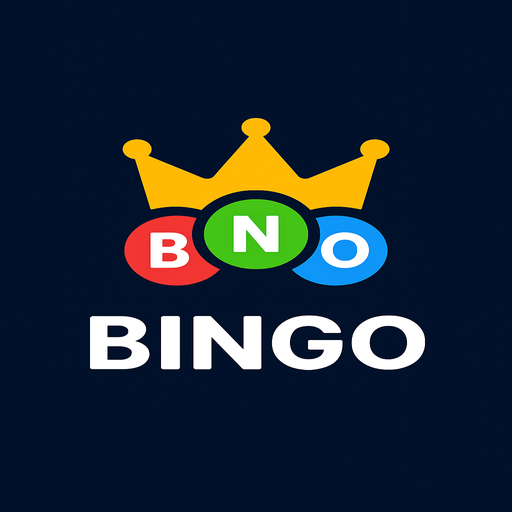

<!DOCTYPE html>
<html>
<body>

<h1>Bingo TV - Aplicación interactiva para televisores webOS</h1>

Bingo TV es una aplicación interactiva de Bingo diseñada específicamente para televisores con webOS, que combina la emoción del bingo tradicional con tecnología moderna de voz y efectos visuales.

<h2>🌟 Características principales</h2>

<ul>
    <li>🎯 Generación aleatoria de números de bingo (1-75) con algoritmo sin repetición</li>
    <li>🔊 Anuncios por voz (TTS) de cada número cantado</li>
    <li>🔔 Efectos de sonido integrados para retroalimentación auditiva</li>
    <li>🎨 Interfaz optimizada para control remoto (navegación con flechas)</li>
    <li>📊 Visualización clara organizada por columnas (B-I-N-G-O)</li>
    <li>✨ Efectos visuales para el último número cantado</li>
    <li>🏆 Detección y anuncio automático de columnas completas</li>
    <li>🔄 Reinicio automático al completar todos los números</li>
</ul>

<h2>📸 Capturas de pantalla</h2>

 
<em>Interfaz principal con números destacados</em>

 
<em>Columna completa con indicador visual</em>

<h2>🛠️ Requisitos técnicos</h2>

<ul>
    <li>Televisor LG con webOS 6.0.0 o superior</li>
    <li>Navegador compatible con:
        <ul>
            <li>Web Audio API</li>
            <li>CSS Grid</li>
        </ul>
    </li>
    <li>Permisos de audio y TTS (Text-to-Speech)</li>
</ul>

<h2>🚀 Instalación</h2>

<h3>Para desarrollo local</h3>

<pre><code>git clone https://github.com/tu-usuario/bingo-tv.git
cd bingo-tv
</code></pre>

Abre el archivo <code>index.html</code> en tu navegador preferido.

<h3>Para despliegue en webOS</h3>

<pre><code>npm install -g @webosose/ares-cli
ares-package .
ares-install com.example.bingo_1.0.1_all.ipk -d &lt;tu-dispositivo&gt;
</code></pre>

<h2>🎮 Cómo jugar</h2>

<table>
    <tr>
        <th>Control</th>
        <th>Acción</th>
    </tr>
    <tr>
        <td>ENTER/OK</td>
        <td>Iniciar o detener el juego</td>
    </tr>
    <tr>
        <td>Flecha izquierda</td>
        <td>Navegar a la columna izquierda</td>
    </tr>
    <tr>
        <td>Flecha derecha</td>
        <td>Navegar a la columna derecha</td>
    </tr>
    <tr>
        <td>ESC</td>
        <td>Salir de la aplicación</td>
    </tr>
</table>

<h2>🛠 Personalización</h2>

Puedes modificar los siguientes aspectos:

<strong>Intervalo entre números</strong>:
Edita el valor en milisegundos en <code>app.js</code> (línea ~96):

<pre><code>this.intervalId = setInterval(() => this.generateNumber(), 7000); // Cambia 7000 por el valor deseado
</code></pre>

<strong>Colores y estilos</strong>:
Modifica el archivo <code>style.css</code> para personalizar:

<pre><code>/* Ejemplo: cambiar color principal */
body {
  background: radial-gradient(circle at center, #2a1a5e 0%, #0a0a2a 100%);
}
</code></pre>

<strong>Efectos de sonido</strong>:
Ajusta los parámetros en <code>playBeep()</code>:

<pre><code>oscillator.frequency.value = 800; // Frecuencia en Hz
gainNode.gain.value = 0.5;       // Volumen (0 a 1)
</code></pre>

<h2>📂 Estructura del proyecto</h2>

<pre><code>bingo-tv/
├── assets/                  # Recursos multimedia
│   └── images/              # Imágenes e iconos
│       └── imagen_3.png
├── index.html               # Punto de entrada HTML
├── app.js                   # Lógica principal
├── style.css                # Estilos CSS
├── appinfo.json             # Configuración webOS
├── README.md                # Este archivo
└── LICENSE                  # Licencia del proyecto
</code></pre>

<h2>🤝 Cómo contribuir</h2>

¡Tus contribuciones son bienvenidas! Sigue estos pasos:

<ol>
    <li>Haz un fork del proyecto</li>
    <li>Crea una rama para tu feature (<code>git checkout -b feature/nueva-funcionalidad</code>)</li>
    <li>Haz commit de tus cambios (<code>git commit -m 'Añade nueva funcionalidad'</code>)</li>
    <li>Haz push a la rama (<code>git push origin feature/nueva-funcionalidad</code>)</li>
    <li>Abre un Pull Request</li>
</ol>

<h2>📜 Licencia</h2>

Distribuido bajo la licencia MIT. Consulta el archivo <code>LICENSE</code> para más información.

<h2>✉️ Contacto</h2>

Everson Cuellar - <a href="mailto:tu-email@example.com">tu-email@example.com</a>

Enlace del proyecto: <a href="https://github.com/tu-usuario/bingo-tv">https://github.com/tu-usuario/bingo-tv</a>

<h2>Roadmap</h2>

<ul>
    <li><input type="checkbox" checked> Versión inicial funcional</li>
    <li><input type="checkbox"> Modo multijugador local</li>
    <li><input type="checkbox"> Cartones de bingo virtuales</li>
    <li><input type="checkbox"> Más opciones de personalización</li>
    <li><input type="checkbox"> Soporte para múltiples idiomas</li>
    <li><input type="checkbox"> Integración con servicios en la nube</li>
</ul>

<h2>Agradecimientos</h2>

<ul>
    <li>Equipo de desarrollo de webOS</li>
    <li>Comunidad de desarrolladores de LG</li>
    <li>Todos los contribuyentes y testers</li>
</ul>

<em>¡Diviértete jugando al Bingo!</em> 🎉

</body>
</html>
